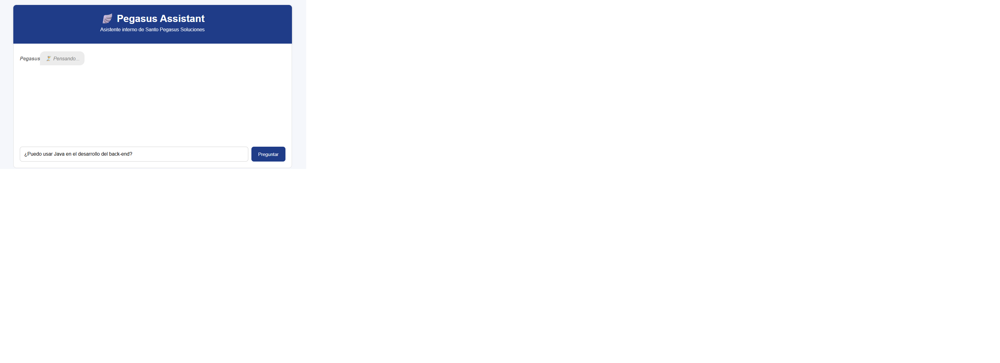
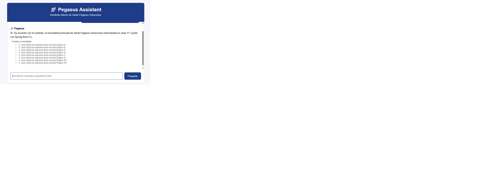
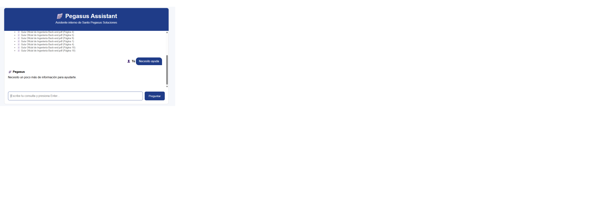
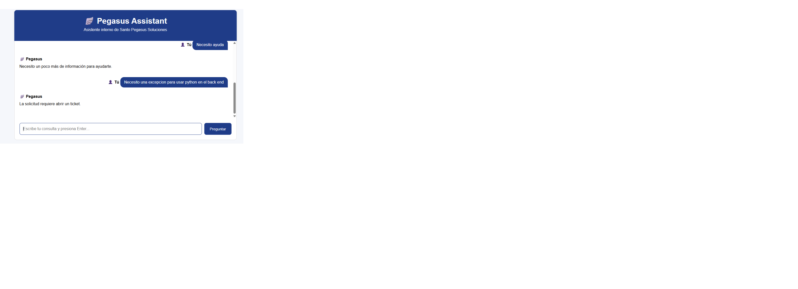

# Asistente documental con RAG y agente de decisión

Este proyecto implementa un asistente conversacional capaz de responder preguntas sobre documentos internos utilizando un flujo de Recuperación Aumentada por Generación (RAG). Además, incluye un agente de clasificación que decide si una solicitud puede resolverse automáticamente, si necesita más información o si debe derivarse a un ticket.

## Arquitectura del sistema

La solución está compuesta por varias capas que trabajan en conjunto:

1. **Interfaz web**
   - Una app Flask expone una interfaz sencilla en la ruta principal.
   - El usuario escribe una pregunta y recibe una respuesta con referencias a los documentos consultados.

2. **Agente de decisión**
   - El servicio principal analiza la intención del usuario y determina qué tipo de acción corresponde.
   - Puede optar por:
     - resolver automáticamente con RAG,
     - solicitar más información,
     - o indicar que se debe abrir un ticket.

3. **Motor RAG**
   - El sistema recupera fragmentos relevantes de los documentos almacenados.
   - El modelo de lenguaje genera una respuesta basada en esos fragmentos, mejorando la precisión y la trazabilidad.

4. **Almacenamiento y modelos**
   - Los documentos fuente se encuentran en la carpeta documentos.
   - El índice vectorial FAISS se guarda en la carpeta vectorstore.
   - La integración con Gemini se maneja desde los módulos de LLM.

## Ejemplos de preguntas y respuestas

El agente puede responder preguntas como las siguientes:

- Pregunta: "¿Cuáles son las políticas para desplegar un servicio nuevo?"
  - Respuesta: El sistema recupera la información relevante y responde con un resumen acompañado de las fuentes consultadas.

- Pregunta: "¿Qué debo hacer si necesito una excepción para una regla de seguridad?"
  - Respuesta: El agente identifica que la solicitud requiere una acción especial y orienta hacia la apertura de un ticket.

- Pregunta: "Necesito más contexto para evaluar esta solicitud."
  - Respuesta: El sistema puede pedir información adicional si la pregunta no es lo suficientemente clara.

## Instrucciones de ejecución

### Requisitos

- Python 3.10 o superior
- Una clave de API de Gemini configurada en la variable de entorno GEMINI_API_KEY

### Pasos

1. Crear y activar un entorno virtual:

   En Windows PowerShell:

   ```powershell
   python -m venv .venv
   .\.venv\Scripts\Activate.ps1
   ```

2. Instalar dependencias:

   ```bash
   pip install -r requirements.txt
   ```

3. Crear un archivo `.env` en la raíz del proyecto con el siguiente contenido:

   ```env
   GEMINI_API_KEY=tu_api_key
   CHAT_MODEL=gemini-2.0-flash
   EMBEDDING_MODEL=models/text-embedding-004
   ```

4. Colocar los documentos fuente en la carpeta documentos.

5. Ejecutar la aplicación:

   ```bash
   python web.py
   ```

6. Abrir el navegador en:

   ```text
   http://127.0.0.1:5000
   ```

## Evidencia del proyecto

A continuación se muestran las imágenes disponibles en la carpeta evidencia:










## Notas importantes

- Si el índice FAISS aún no existe, la primera ejecución lo creará automáticamente.
- Los logs de ejecución se almacenan en la carpeta logs.
- La interfaz web está construida con Flask y los templates se encuentran en la carpeta templates.
